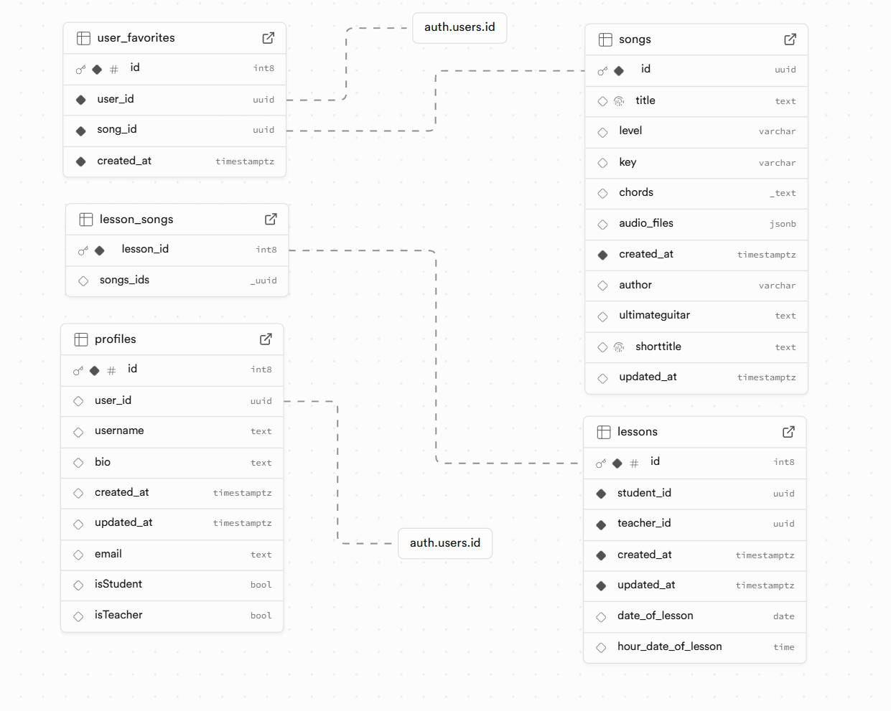

# Song Manager

A modern web application for efficient song management and organization. This platform provides a seamless interface for managing your music collection with robust authentication, sorting capabilities, and an intuitive dashboard.

## 🎵 Features

### Authentication

- Authentication is handled by Supabase
- Protected routes and user sessions

### Dashboard

- Intuitive user interface for song management
- Real-time data updates
- Responsive design for all devices

### Song Management

- Comprehensive song listing and organization
- Advanced sorting functionality for song tables
- Data validation using Zod schemas
- CRUD operations for song entries

### Landing Page

- Engaging hero section showcasing core features
- Team section highlighting project contributors
- Feature showcase section

## 🛠️ Tech Stack

- **Frontend Framework**: Next.js
- **Database**: Supabase
- **Authentication**: Supabase Auth
- **Data Validation**: Zod
- **Styling**: Tailwind CSS
- **API**: RESTful endpoints with Next.js API routes

## Future Enhancements

Here are some potential features and improvements planned for future releases:

1. **Playlist Management**

   - Create, edit, and delete playlists.
   - Add or remove songs from playlists.

2. **Search and Filter**

   - Implement a search bar to find songs by title, artist, or album.
   - Add filtering options to sort songs by genre, release date, or popularity.

3. **User Profiles**

   - Allow users to create and customize profiles.
   - Display user-specific data, such as recently played songs or favorite playlists.

4. **Social Features**

   - Enable users to share playlists or songs with friends.
   - Implement a commenting or rating system for songs.

5. **Analytics Dashboard**

   - Provide insights into user behavior, such as most played songs or popular playlists.
   - Display statistics on song uploads and user engagement.

6. **Offline Access**

   - Allow users to download songs or playlists for offline listening.
   - Implement caching strategies to improve performance and offline capabilities.

7. **Integration with Music APIs**

   - Integrate with external music APIs (e.g., Spotify, Apple Music) to fetch additional song metadata or stream music.

8. **Improved UI/UX**

   - Enhance the user interface with animations and transitions.
   - Conduct user testing to gather feedback and improve usability.

9. **Mobile Application**

   - Develop a mobile version of the application using React Native or another mobile framework.

10. **Internationalization**
    - Add support for multiple languages to reach



## 🚀 Getting Started

### Prerequisites

- Node.js (v14 or higher)
- npm or yarn
- Supabase account
- Google OAuth credentials

### Installation

1. Clone the repository

```bash
git clone [repository-url]
cd song-manager
```

2. Install dependencies

```bash
npm install
# or
yarn install
```

3. Configure environment variables

```bash
# Create a .env.local file with the following variables
NEXTAUTH_URL=http://localhost:3000
NEXTAUTH_SECRET=your-nextauth-secret
GOOGLE_ID=your-google-client-id
GOOGLE_SECRET=your-google-client-secret
SUPABASE_URL=your-supabase-url
SUPABASE_ANON_KEY=your-supabase-anon-key
```

4. Run the development server

```bash
npm run dev
# or
yarn dev
```

5. Open [http://localhost:3000](http://localhost:3000) in your browser

## 📝 License

This project is licensed under the MIT License - see the LICENSE file for details.
